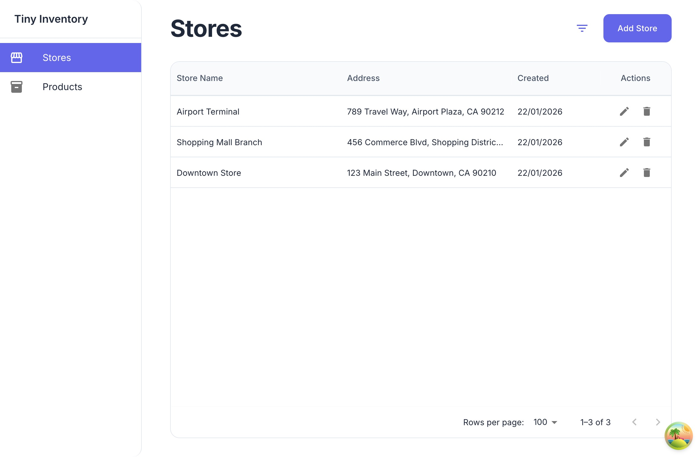
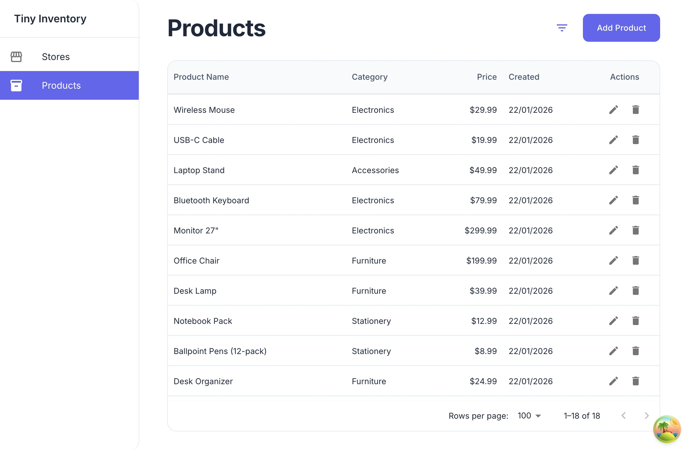

# Tiny Inventory Management System

A full-stack inventory management application built with NestJS (backend) and React (frontend), featuring store and product management with real-time statistics and observability.


## Table of Contents

- [Features](#features)
- [Run Instructions](#run-instructions)
- [API Overview](#api-overview)
- [Decisions & Trade-offs](#decisions--trade-offs)
- [Testing Approach](#testing-approach)
- [If I Had More Time](#if-i-had-more-time)

## Features

### Store Management




- View all stores with pagination
- Create new stores
- Edit store information
- Delete stores
- View store details
- See products available in each store
- View store statistics (total inventory value, product count, stock quantity, average price)

### Product Management



- View all products with filtering and pagination
- Create new products
- Edit product information
- Delete products
- View product details


## Run Instructions

### Prerequisites
- Docker and Docker Compose
- Node.js 25+ (for local development)
- npm

### Quick Start (Docker)

1. **Start all services:**
   ```bash
   make up
   # or
   docker compose up -d
   ```

2. **Access the application:**
   - Web UI: http://localhost:80
   - API: http://localhost:3000
   - API Documentation (Swagger): http://localhost:3000/docs
   - Jaeger UI (tracing): http://localhost:16686

3. **View logs:**
   ```bash
   make logs
   # or
   docker compose logs -f
   ```

4. **Stop services:**
   ```bash
   make down
   # or
   docker compose down
   ```

### Development Mode

1. **Install dependencies:**
   ```bash
   make install
   ```

2. **Start database:**
   ```bash
   make postgres-up
   ```

3. **Run backend (in separate terminal):**
   ```bash
   make dev-backend
   ```

4. **Run frontend (in separate terminal):**
   ```bash
  make dev-frontend
   ```

### Other Useful Commands

- `make build` - Build all Docker images
- `make restart` - Restart all services
- `make clean` - Remove all containers, volumes, and images
- `make test-unit` - Run unit tests for both frontend and backend

## API Overview

The REST API provides endpoints for managing stores, products, and inventory statistics:

- **Stores**: 
  - `GET /stores` - List all stores
  - `POST /stores` - Create a new store
  - `GET /stores/:id` - Get store details
  - `PATCH /stores/:id` - Update a store
  - `DELETE /stores/:id` - Delete a store
  - `POST /stores/:id/products` - Add product to store
  - `DELETE /stores/:id/products` - Remove product from store
  - `GET /stores/:id/statistics` - Get store statistics

- **Products**: 
  - `GET /products` - List products (with filtering and pagination)
  - `POST /products` - Create a new product
  - `GET /products/:id` - Get product details
  - `PATCH /products/:id` - Update a product
  - `DELETE /products/:id` - Delete a product

- **Health**: 
  - `GET /health` - Service health check

All endpoints return JSON and support validation. You can view interactive API documentation at http://localhost:3000/docs

## Decisions & Trade-offs
 
**Architecture**: Chose NestJS for its modular structure, dependency injection, and built-in validation. Prisma was selected for type-safe database access and migrations, trading some flexibility for developer experience.

**Observability**: Integrated OpenTelemetry with Jaeger for distributed tracing, enabling production-ready monitoring. Added structured logging with Winston and trace correlation, prioritizing debuggability over minimal overhead.

**Database Design**: Used a many-to-many relationship (StoreProduct junction table) to allow products to exist in multiple stores with independent stock. This supports scalability but requires careful handling of stock updates across stores.

**API Design**: RESTful endpoints with consistent error handling and validation. Swagger documentation is auto-generated for better developer experience, though it adds some decorator overhead.

**Event System**: Message bus abstraction using Node.js EventEmitter emits domain events for microservice communication and async processing (audit logs, metrics, notifications). Designed for future message broker integration (RabbitMQ, Kafka, AWS SNS/SQS) in production.

## Testing Approach

**Unit Tests**: Service layer tests using Jest with mocked Prisma clients to test business logic in isolation. Tests focus on core functionality like CRUD operations, statistics calculations, and error handling.

Run tests with:
```bash
make test-unit
```


## TODO

- **Product-Store Management UI**: Build user interface for adding and removing products from stores (API endpoints already exist).

- **Product Details Page**: Create a dedicated page to view detailed product information and store availability. 

- **Frontend Error Handling**: Add global error boundaries and API error interception with user-friendly error messages.

- **Frontend Metric Tracking**: Implement metric tracking to monitor user interactions, page performance, and API call success rates.

- **Audit Logging**: Track all changes to stores and products with who, when, and what changed.